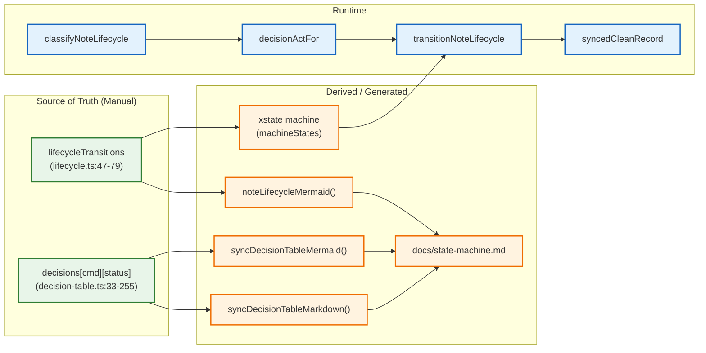
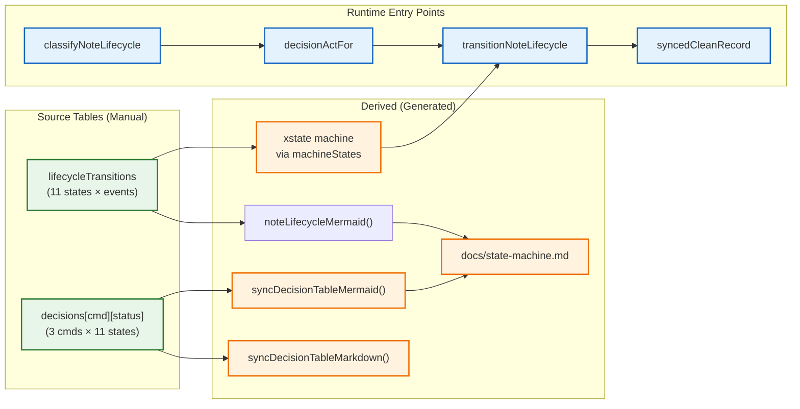
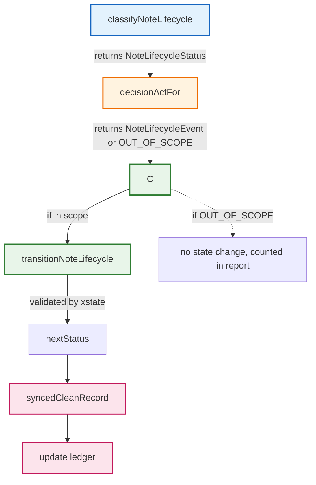
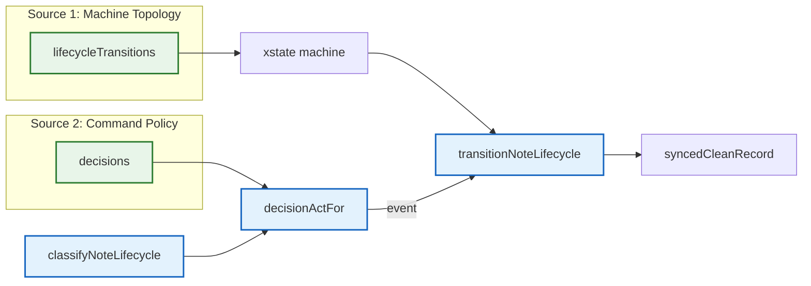

# Note Lifecycle State Machine & Decision Tables

> This document is generated from source code. Do not edit manually.
> Run `pnpm run doc:state-machine` to regenerate.

## 1. Dependency Chain (What Derives From What)

## 2. Source Tables — The Two Independent Authorities

### 2.1 lifecycleTransitions — State Machine Topology

**Location:** `src/services/notes/lifecycle.ts:47-79`  
**11 states, 13 events, ~30 transitions**

This is the **single source of truth** for legal state transitions. The xstate machine, Mermaid diagram, and runtime validation all derive from this table.

```mermaid
stateDiagram-v2
  ankiOnly_neverImported["ankiOnly.neverImported"]
  ankiOnly_fileDeleted["ankiOnly.fileDeleted"]
  synced_clean["synced.clean"]
  synced_ankiNewer["synced.ankiNewer"]
  synced_vaultNewer["synced.vaultNewer"]
  synced_diverged["synced.diverged"]
  linked_unenrolled["linked.unenrolled"]
  vaultOnly_unexported["vaultOnly.unexported"]
  vaultOnly_unenrolled["vaultOnly.unenrolled"]
  vaultOnly_ankiDeleted["vaultOnly.ankiDeleted"]
  orphaned["orphaned"]
  ankiOnly_neverImported --> synced_clean: IMPORT
  ankiOnly_neverImported --> ankiOnly_neverImported: SKIP
  ankiOnly_fileDeleted --> synced_ankiNewer: RESURRECT
  ankiOnly_fileDeleted --> orphaned: PURGE
  synced_clean --> synced_clean: CHECK
  synced_ankiNewer --> synced_clean: PULL
  synced_ankiNewer --> synced_clean: FORCE_PUSH
  synced_vaultNewer --> synced_clean: PUSH
  synced_vaultNewer --> synced_clean: FORCE_PULL
  synced_vaultNewer --> synced_clean: RESOLVE_NEWEST
  synced_diverged --> synced_clean: FORCE_PULL
  synced_diverged --> synced_clean: FORCE_PUSH
  synced_diverged --> synced_clean: RESOLVE_NEWEST
  linked_unenrolled --> synced_clean: ENROLL
  vaultOnly_unexported --> synced_clean: EXPORT
  vaultOnly_unenrolled --> synced_clean: ENROLL
  vaultOnly_ankiDeleted --> orphaned: DELETE_FILE
  vaultOnly_ankiDeleted --> synced_clean: EXPORT
  orphaned --> orphaned: PURGE
```

### 2.2 decisions[command][status] — Command Policy

**Location:** `src/services/notes/decision-table.ts:33-255`  
**3 commands × 11 states = 33 rows**

This is the **second independent authority**. It defines what each command (import/export/sync) does in each state — which event to emit, whether force changes it, who owns the decision, and why.

```mermaid
flowchart LR
  subgraph Commands
    direction TB
    Import["Import (Anki wins)"]
    Export["Export (Obsidian wins)"]
    Sync["Sync (no force)"]
  end

  subgraph States
    direction TB
    ankiOnly_neverImported["ankiOnly.neverImported"]
    ankiOnly_fileDeleted["ankiOnly.fileDeleted"]
    synced_clean["synced.clean"]
    synced_ankiNewer["synced.ankiNewer"]
    synced_vaultNewer["synced.vaultNewer"]
    synced_diverged["synced.diverged"]
    linked_unenrolled["linked.unenrolled"]
    vaultOnly_unexported["vaultOnly.unexported"]
    vaultOnly_unenrolled["vaultOnly.unenrolled"]
    vaultOnly_ankiDeleted["vaultOnly.ankiDeleted"]
    orphaned["orphaned"]
  end

  Export -->|def:—\nforce:—\nkind:create\nowner:import| ankiOnly_neverImported
  Export -->|def:—\nforce:—\nkind:missing\nowner:sync| ankiOnly_fileDeleted
  Export -->|def:CHECK\nforce:—\nkind:quiet\nowner:sync| synced_clean
  Export -->|def:—\nforce:FORCE_PUSH\nkind:skip\nowner:sync| synced_ankiNewer
  synced_ankiNewer -.->|forced: FORCE_PUSH| Export
  Export -->|def:PUSH\nforce:—\nkind:overwrite\nowner:export| synced_vaultNewer
  Export -->|def:—\nforce:FORCE_PUSH\nkind:conflict\nowner:sync| synced_diverged
  synced_diverged -.->|forced: FORCE_PUSH| Export
  Export -->|def:ENROLL\nforce:—\nkind:quiet\nowner:wizard| linked_unenrolled
  Export -->|def:EXPORT\nforce:—\nkind:create\nowner:export| vaultOnly_unexported
  Export -->|def:ENROLL\nforce:—\nkind:quiet\nowner:wizard| vaultOnly_unenrolled
  Export -->|def:—\nforce:EXPORT\nkind:missing\nowner:sync| vaultOnly_ankiDeleted
  vaultOnly_ankiDeleted -.->|forced: EXPORT| Export
  Export -->|def:—\nforce:—\nkind:missing\nowner:purge| orphaned
  Import -->|def:IMPORT\nforce:—\nkind:create\nowner:import| ankiOnly_neverImported
  Import -->|def:—\nforce:RESURRECT\nkind:missing\nowner:sync| ankiOnly_fileDeleted
  ankiOnly_fileDeleted -.->|forced: RESURRECT| Import
  Import -->|def:CHECK\nforce:—\nkind:quiet\nowner:sync| synced_clean
  Import -->|def:PULL\nforce:—\nkind:overwrite\nowner:sync| synced_ankiNewer
  Import -->|def:—\nforce:FORCE_PULL\nkind:skip\nowner:sync| synced_vaultNewer
  synced_vaultNewer -.->|forced: FORCE_PULL| Import
  Import -->|def:—\nforce:FORCE_PULL\nkind:conflict\nowner:sync| synced_diverged
  synced_diverged -.->|forced: FORCE_PULL| Import
  Import -->|def:ENROLL\nforce:—\nkind:quiet\nowner:wizard| linked_unenrolled
  Import -->|def:—\nforce:—\nkind:create\nowner:export| vaultOnly_unexported
  Import -->|def:ENROLL\nforce:—\nkind:quiet\nowner:wizard| vaultOnly_unenrolled
  Import -->|def:—\nforce:—\nkind:missing\nowner:sync| vaultOnly_ankiDeleted
  Import -->|def:—\nforce:—\nkind:missing\nowner:purge| orphaned
  Sync -->|def:—\nforce:—\nkind:create\nowner:import| ankiOnly_neverImported
  Sync -->|def:—\nforce:—\nkind:missing\nowner:sync| ankiOnly_fileDeleted
  Sync -->|def:CHECK\nforce:—\nkind:quiet\nowner:sync| synced_clean
  Sync -->|def:PULL\nforce:—\nkind:overwrite\nowner:sync| synced_ankiNewer
  Sync -->|def:PUSH\nforce:—\nkind:overwrite\nowner:sync| synced_vaultNewer
  Sync -->|def:RESOLVE_NEWEST\nforce:—\nkind:conflict\nowner:sync| synced_diverged
  Sync -->|def:—\nforce:—\nkind:quiet\nowner:wizard| linked_unenrolled
  Sync -->|def:—\nforce:—\nkind:create\nowner:export| vaultOnly_unexported
  Sync -->|def:—\nforce:—\nkind:quiet\nowner:wizard| vaultOnly_unenrolled
  Sync -->|def:—\nforce:—\nkind:missing\nowner:sync| vaultOnly_ankiDeleted
  Sync -->|def:—\nforce:—\nkind:missing\nowner:purge| orphaned

  classDef cmd fill:#e1f5fe,stroke:#01579b,stroke-width:2px;
  classDef state fill:#f3e5f5,stroke:#4a148c,stroke-width:1px;
  class Import,Export,Sync cmd;
  class ankiOnly_neverImported state;
  class ankiOnly_fileDeleted state;
  class synced_clean state;
  class synced_ankiNewer state;
  class synced_vaultNewer state;
  class synced_diverged state;
  class linked_unenrolled state;
  class vaultOnly_unexported state;
  class vaultOnly_unenrolled state;
  class vaultOnly_ankiDeleted state;
  class orphaned state;
```

#### Decision Table (Markdown)

| State | Import (Anki wins) | Export (Obsidian wins) | Sync (no force) |
|-------|--------------------|------------------------|-----------------|
| `ankiOnly.neverImported` | `—` create · import Anki only: the import wizard brings it in. | `IMPORT` create · import Anki only: creates the file. | `—` create · import Untracked Anki note: counted as needing import. |
| `ankiOnly.fileDeleted` | `—` missing · sync File gone: Sync decides, nothing to push. | `—` / `RESURRECT` (force) missing · sync **Force:** RESURRECT (Anki wins) File gone: Sync decides, Anki wins re-creates it. Forced: Anki wins: re-creates the file you deleted. | `—` missing · sync No file: the purge path handles it outside this table, the tombstone rule arrives with OBSID-19. |
| `synced.clean` | `CHECK` quiet · sync Both sides match: nothing to write. | `CHECK` quiet · sync Both sides match: rewrites nothing. Forced: Anki wins: rewrites the same content. | `CHECK` quiet · sync Both sides match: nothing to do. |
| `synced.ankiNewer` | `—` / `FORCE_PUSH` (force) skip · sync **Force:** FORCE_PUSH (Obsidian wins) Newer in Anki: skipped, use Sync. Forced: Obsidian wins: overwrites Anki. | `PULL` overwrite · sync Newer in Anki: overwrites your file. | `PULL` overwrite · sync Newer in Anki: refreshes the vault file. |
| `synced.vaultNewer` | `PUSH` overwrite · export Newer in Obsidian: pushes to Anki. | `—` / `FORCE_PULL` (force) skip · sync **Force:** FORCE_PULL (Anki wins) Newer in Obsidian: skipped, use Sync. Forced: Anki wins: overwrites your newer edits. | `PUSH` overwrite · sync Newer in Obsidian: pushes to Anki. |
| `synced.diverged` | `—` / `FORCE_PUSH` (force) conflict · sync **Force:** FORCE_PUSH (Obsidian wins) Edited in both: skipped, use Sync. Forced: Obsidian wins: overwrites Anki. | `—` / `FORCE_PULL` (force) conflict · sync **Force:** FORCE_PULL (Anki wins) Edited in both: newest wins on Sync. Forced: Anki wins: overwrites your newer edits. | `RESOLVE_NEWEST` conflict · sync Edited in both: the newer side wins. |
| `linked.unenrolled` | `ENROLL` quiet · wizard Has an id but no record: enrols it, writes nothing. | `ENROLL` quiet · wizard Has an id but no record: enrols it, rewrites the same file. | `—` quiet · wizard Enrolling is the wizards' job. |
| `vaultOnly.unexported` | `EXPORT` create · export Vault only: creates the Anki note, writes the id back. | `—` create · export Vault only: the export wizard creates it. | `—` create · export Vault only: the export wizard creates it. |
| `vaultOnly.unenrolled` | `ENROLL` quiet · wizard Has an id but no record: enrols it, writes nothing. | `ENROLL` quiet · wizard Has an id but no record: enrols it, rewrites the same file. | `—` quiet · wizard Enrolling is the wizards' job. |
| `vaultOnly.ankiDeleted` | `—` / `EXPORT` (force) missing · sync **Force:** EXPORT (Obsidian wins) Gone from Anki: Sync applies the deletion. Forced: Obsidian wins: re-creates it in Anki. | `—` missing · sync Gone from Anki: Sync deletes the file. | `—` missing · sync Gone from Anki: the purge path handles it, DELETE_FILE arrives with OBSID-20. |
| `orphaned` | `—` missing · purge Only a stale record left: Purge ledger forgets it. | `—` missing · purge Only a stale record left: Purge ledger forgets it. | `—` missing · purge Only a stale record left: Purge ledger forgets it. |

## 3. How They Relate — Dependency Graph

## 4. Classification & Event Resolution — The Runtime Flow

Every sync operation follows this chain:

### Step-by-step

1. **classifyNoteLifecycle(anki?, block?, record?)** — Single entry point. Compares:
   - `block.hash !== record.lastHash` → `vaultDirty`
   - `anki.mod > record.lastMod` → `ankiDirty`
   - Returns one of 11 `NoteLifecycleStatus` values.

2. **decisionActFor(command, status, forced?)** — Looks up `decisions[command][status]`:
   - Returns `act` (default) or `forcedAct` (if `isForced`).
   - May return `OUT_OF_SCOPE` (command defers to another).

3. **transitionNoteLifecycle(status, event)** — Gateway:
   - Validates `event` exists in `NOTE_LIFECYCLE_EVENTS`.
   - Uses xstate snapshot to check `can({type: event})`.
   - Throws if illegal; returns `nextStatus` if legal.

4. **syncedCleanRecord(hash, mod)** — Creates fresh ledger record:
   - `lastHash` = content hash
   - `lastMod` = Anki's `mod` (seconds)
   - `status = "synced.clean"`

## 5. The Two Tables — Relationship at Runtime

## 6. Classification Logic — How State Is Determined

`classifyNoteLifecycle(inputs)` (lifecycle.ts:239-280) evaluates:

| anki | block | record | → status |
|------|-------|--------|----------|
| ✓ | ✗ | ✗ | ankiOnly.neverImported |
| ✓ | ✗ | ✓ | ankiOnly.fileDeleted |
| ✓ | ✓ | ✗ | linked.unenrolled |
| ✓ | ✓ | ✓ | synced.clean / ankiNewer / vaultNewer / diverged |
| ✗ | ✓ (no id) | ✗ | vaultOnly.unexported |
| ✗ | ✓ (id) | ✗ | vaultOnly.unenrolled |
| ✗ | ✓ | ✓ | vaultOnly.ankiDeleted |
| ✗ | ✗ | ✓ | orphaned |

For the 3-present case: `vaultDirty = block.hash !== record.lastHash`, `ankiDirty = anki.mod > record.lastMod`.

## 7. Clocks, Hashes & Deletions

- **Hash-first dirtiness:** `lastHash = hash(front\nback\ntags\nmodel)`. Content change → dirty; our own writes don't look like foreign changes.
- **Clocks:** Anki `mod` (unix seconds) vs file `mtime` (ms). `isAnkiNewer = (anki.mod * 1000) > file.stat.mtime`. Used only by `Sync` command.
- **Ties:** < 1s difference → vault wins (OBSID-21 open for configurable threshold).
- **Post-write real mod:** After any Anki write, ledger stores actual `mod` from `notesInfo` round-trip → prevents ping-pong.
- **Missing file resolution:** `resolveMissingFile(ankiMod, recordLastMod)` → `ankiMod > recordLastMod` ? `RESURRECT` : `PURGE`.
- **Anki deletion:** Note gone from `findNotes` → block removed, record deleted.

## 8. Command Scopes

| Capability | Import | Export | Sync |
|------------|--------|--------|------|
| Pull (vault ← Anki) | ✓ | ✗ | ✓ |
| Push (vault → Anki) | ✗ | ✓ | ✓ |
| Resolve clocks | ✗ | ✗ | ✓ (RESOLVE_NEWEST) |
| Force (per note) | Anki wins | Obsidian wins | none |
| Deletions | never resolves | never resolves | resolves |
| Enroll | ✓ | ✓ | ✗ (wizards only) |

## 9. Anti-Drift Guarantees

| Artifact | Generator | Source | Anti-Drift Test |
|----------|-----------|--------|-----------------|
| State Machine Mermaid | `noteLifecycleMermaid()` | `lifecycleTransitions` | `lifecycle.test.ts:252-263` |
| Decision Table Mermaid | `syncDecisionTableMermaid()` | `decisions` | `decision-table.test.ts` (new) |
| Decision Table Markdown | `syncDecisionTableMarkdown()` | `decisions` | `decision-table.test.ts:268-278` |

Run `pnpm run doc:state-machine` to regenerate this document.
Run `pnpm run test` to verify anti-drift.

---

*Generated by `pnpm run doc:state-machine` from `src/dev/print-state-machine.ts`*
