# Note Lifecycle State Machine & Decision Tables

> This document is generated from source code. Do not edit manually.
> Run `pnpm run doc:state-machine` to regenerate.

## 1. State Machine Topology

**Location:** `src/services/notes/lifecycle.ts:47-79`  
**11 states, 13 events, ~30 transitions**

This is the **single source of truth** for legal state transitions. The xstate machine, Mermaid diagram, and runtime validation all derive from this table.

State Machine Topology

## 2. Decision Tables — Command Policies

**Location:** `src/services/notes/decision-table.ts:33-255`  
**3 commands × 11 states = 33 rows**

This is the **second independent authority**. It defines what each command (import/export/sync) does in each state — which event to emit, whether force changes it, who owns the decision, and why.

### 1. Export Wizard (force: Obsidian wins)

Export Wizard (force: Obsidian wins)

### 2. Import Wizard (force: Anki wins)

Import Wizard (force: Anki wins)

### 3. Sync Command (no force)

Sync Command (no force)

#### Decision Table (Markdown) — State-Centric (Transposed)

| State | Import (Anki wins) | Export (Obsidian wins) | Sync (no force) |
|-------|--------------------|------------------------|-----------------|
| `ankiOnly.neverImported` | `—` create · import Anki only: the import wizard brings it in. | `IMPORT` create · import Anki only: creates the file. | `—` create · import Untracked Anki note: counted as needing import. |
| `ankiOnly.fileDeleted` | `—` missing · sync File gone: Sync decides, nothing to push. | `—` / `RESURRECT` (force) missing · sync **Force:** RESURRECT (Anki wins) File gone: Sync decides, Anki wins re-creates it. Forced: Anki wins: re-creates the file you deleted. | `—` missing · sync No file: the purge path handles it outside this table, the tombstone rule arrives with OBSID-19. |
| `synced.clean` | `CHECK` quiet · sync Both sides match: nothing to write. | `CHECK` quiet · sync Both sides match: rewrites nothing. Forced: Anki wins: rewrites the same content. | `CHECK` quiet · sync Both sides match: nothing to do. |
| `synced.ankiNewer` | `—` / `FORCE_PUSH` (force) skip · sync **Force:** FORCE_PUSH (Obsidian wins) Newer in Anki: skipped, use Sync. Forced: Obsidian wins: overwrites Anki. | `PULL` overwrite · sync Newer in Anki: overwrites your file. | `PULL` overwrite · sync Newer in Anki: refreshes the vault file. |
| `synced.vaultNewer` | `PUSH` overwrite · export Newer in Obsidian: pushes to Anki. | `—` / `FORCE_PULL` (force) skip · sync **Force:** FORCE_PULL (Anki wins) Newer in Obsidian: skipped, use Sync. Forced: Anki wins: overwrites your newer edits. | `PUSH` overwrite · sync Newer in Obsidian: pushes to Anki. |
| `synced.diverged` | `—` / `FORCE_PUSH` (force) conflict · sync **Force:** FORCE_PUSH (Obsidian wins) Edited in both: skipped, use Sync. Forced: Obsidian wins: overwrites Anki. | `—` / `FORCE_PULL` (force) conflict · sync **Force:** FORCE_PULL (Anki wins) Edited in both: newest wins on Sync. Forced: Anki wins: overwrites your newer edits. | `RESOLVE_NEWEST` conflict · sync Edited in both: the newer side wins. |
| `linked.unenrolled` | `ENROLL` quiet · wizard Has an id but no record: enrols it, writes nothing. | `ENROLL` quiet · wizard Has an id but no record: enrols it, rewrites the same file. | `—` quiet · wizard Enrolling is the wizards' job. |
| `vaultOnly.unexported` | `EXPORT` create · export Vault only: creates the Anki note, writes the id back. | `—` create · export Vault only: the export wizard creates it. | `—` create · export Vault only: the export wizard creates it. |
| `vaultOnly.unenrolled` | `ENROLL` quiet · wizard Has an id but no record: enrols it, writes nothing. | `ENROLL` quiet · wizard Has an id but no record: enrols it, rewrites the same file. | `—` quiet · wizard Enrolling is the wizards' job. |
| `vaultOnly.ankiDeleted` | `—` / `EXPORT` (force) missing · sync **Force:** EXPORT (Obsidian wins) Gone from Anki: Sync applies the deletion. Forced: Obsidian wins: re-creates it in Anki. | `—` missing · sync Gone from Anki: Sync deletes the file. | `—` missing · sync Gone from Anki: the purge path handles it, DELETE_FILE arrives with OBSID-20. |
| `orphaned` | `—` missing · purge Only a stale record left: Purge ledger forgets it. | `—` missing · purge Only a stale record left: Purge ledger forgets it. | `—` missing · purge Only a stale record left: Purge ledger forgets it. |

Command-Centric Tables (per command)

### export (force: Obsidian wins)

| state | kind | default | forced | owner | why |
| --- | --- | --- | --- | --- | --- |
| `ankiOnly.neverImported` | `create` | `—` | `—` | `import` | Anki only: the import wizard brings it in. |
| `ankiOnly.fileDeleted` | `missing` | `—` | `—` | `sync` | File gone: Sync decides, nothing to push. |
| `synced.clean` | `quiet` | `CHECK` | `—` | `sync` | Both sides match: nothing to write. |
| `synced.ankiNewer` | `skip` | `—` | `FORCE_PUSH` | `sync` | Newer in Anki: skipped, use Sync. Forced: Obsidian wins: overwrites Anki. |
| `synced.vaultNewer` | `overwrite` | `PUSH` | `—` | `export` | Newer in Obsidian: pushes to Anki. |
| `synced.diverged` | `conflict` | `—` | `FORCE_PUSH` | `sync` | Edited in both: skipped, use Sync. Forced: Obsidian wins: overwrites Anki. |
| `linked.unenrolled` | `quiet` | `ENROLL` | `—` | `wizard` | Has an id but no record: enrols it, writes nothing. |
| `vaultOnly.unexported` | `create` | `EXPORT` | `—` | `export` | Vault only: creates the Anki note, writes the id back. |
| `vaultOnly.unenrolled` | `quiet` | `ENROLL` | `—` | `wizard` | Has an id but no record: enrols it, writes nothing. |
| `vaultOnly.ankiDeleted` | `missing` | `—` | `EXPORT` | `sync` | Gone from Anki: Sync applies the deletion. Forced: Obsidian wins: re-creates it in Anki. |
| `orphaned` | `missing` | `—` | `—` | `purge` | Only a stale record left: Purge ledger forgets it. |

### import (force: Anki wins)

| state | kind | default | forced | owner | why |
| --- | --- | --- | --- | --- | --- |
| `ankiOnly.neverImported` | `create` | `IMPORT` | `—` | `import` | Anki only: creates the file. |
| `ankiOnly.fileDeleted` | `missing` | `—` | `RESURRECT` | `sync` | File gone: Sync decides, Anki wins re-creates it. Forced: Anki wins: re-creates the file you deleted. |
| `synced.clean` | `quiet` | `CHECK` | `—` | `sync` | Both sides match: rewrites nothing. Forced: Anki wins: rewrites the same content. |
| `synced.ankiNewer` | `overwrite` | `PULL` | `—` | `sync` | Newer in Anki: overwrites your file. |
| `synced.vaultNewer` | `skip` | `—` | `FORCE_PULL` | `sync` | Newer in Obsidian: skipped, use Sync. Forced: Anki wins: overwrites your newer edits. |
| `synced.diverged` | `conflict` | `—` | `FORCE_PULL` | `sync` | Edited in both: newest wins on Sync. Forced: Anki wins: overwrites your newer edits. |
| `linked.unenrolled` | `quiet` | `ENROLL` | `—` | `wizard` | Has an id but no record: enrols it, rewrites the same file. |
| `vaultOnly.unexported` | `create` | `—` | `—` | `export` | Vault only: the export wizard creates it. |
| `vaultOnly.unenrolled` | `quiet` | `ENROLL` | `—` | `wizard` | Has an id but no record: enrols it, rewrites the same file. |
| `vaultOnly.ankiDeleted` | `missing` | `—` | `—` | `sync` | Gone from Anki: Sync deletes the file. |
| `orphaned` | `missing` | `—` | `—` | `purge` | Only a stale record left: Purge ledger forgets it. |

### sync (force: no force)

| state | kind | default | forced | owner | why |
| --- | --- | --- | --- | --- | --- |
| `ankiOnly.neverImported` | `create` | `—` | `—` | `import` | Untracked Anki note: counted as needing import. |
| `ankiOnly.fileDeleted` | `missing` | `—` | `—` | `sync` | No file: the purge path handles it outside this table, the tombstone rule arrives with OBSID-19. |
| `synced.clean` | `quiet` | `CHECK` | `—` | `sync` | Both sides match: nothing to do. |
| `synced.ankiNewer` | `overwrite` | `PULL` | `—` | `sync` | Newer in Anki: refreshes the vault file. |
| `synced.vaultNewer` | `overwrite` | `PUSH` | `—` | `sync` | Newer in Obsidian: pushes to Anki. |
| `synced.diverged` | `conflict` | `RESOLVE_NEWEST` | `—` | `sync` | Edited in both: the newer side wins. |
| `linked.unenrolled` | `quiet` | `—` | `—` | `wizard` | Enrolling is the wizards' job. |
| `vaultOnly.unexported` | `create` | `—` | `—` | `export` | Vault only: the export wizard creates it. |
| `vaultOnly.unenrolled` | `quiet` | `—` | `—` | `wizard` | Enrolling is the wizards' job. |
| `vaultOnly.ankiDeleted` | `missing` | `—` | `—` | `sync` | Gone from Anki: the purge path handles it, DELETE_FILE arrives with OBSID-20. |
| `orphaned` | `missing` | `—` | `—` | `purge` | Only a stale record left: Purge ledger forgets it. |

---

*Generated by `pnpm run doc:state-machine` from `src/dev/print-state-machine.ts`*
